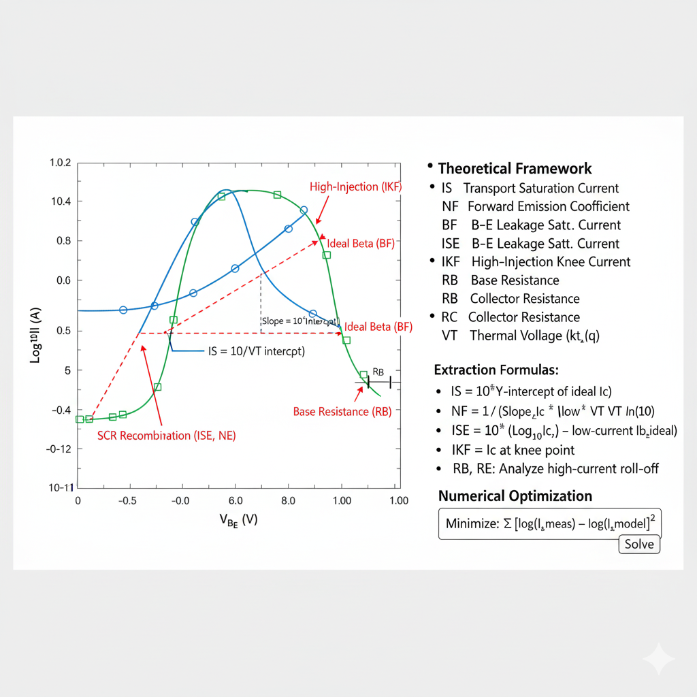

## Theory
**Introduction:**  
BJT Parameter Extraction from Forward Gummel Plots

      
      
<strong>Fig. 1. Forward I-V Characteristic & Parameter Extraction</strong>

## Introduction

The **forward Gummel plot** is a standard BJT characterization method and a primary tool for extracting parameters for the SPICE Gummel-Poon model. It consists of plotting the collector current ($I_C$) and base current ($I_B$) on a logarithmic scale against the base-emitter voltage ($V_{BE}$) on a linear scale, while the base-collector voltage is held constant at zero ($V_{BC} = 0$).

This plot reveals the different physical mechanisms dominating the transistor's operation at various current levels, allowing for the direct extraction of key model parameters.

## The Gummel-Poon Model (Forward Active)

In the forward-active region ($V_{BC}=0$), the Gummel-Poon model simplifies. The collector and base currents are described by:

$$
I_C = \frac{IS}{q_b} \cdot \left( e^{\frac{V_{BE}}{NF \cdot V_T}} - 1 \right)
$$

$$
I_B = \left[ \frac{IS}{BF} \cdot \left( e^{\frac{V_{BE}}{NF \cdot V_T}} - 1 \right) \right] + \left[ ISE \cdot \left( e^{\frac{V_{BE}}{NE \cdot V_T}} - 1 \right) \right]
$$

Where:
* **$IS$**: Transport Saturation Current
* **$BF$**: Ideal Maximum Forward Beta
* **$NF$**: Forward Current Emission Coefficient (ideality factor for $I_C$)
* **$ISE$**: Base-Emitter Leakage Saturation Current
* **$NE$**: Base-Emitter Leakage Emission Coefficient (ideality factor for non-ideal $I_B$)
* **$q_b$**: Normalized base charge, which models high-current effects.
* **$V_T$**: Thermal Voltage ($kT/q$)

## Graphical Extraction from Plot Regions

By analyzing the slopes and intercepts of the $I_C$ and $I_B$ curves, we can extract these parameters.

### 1. Ideal Mid-Current Region

In this region, both $I_C$ and the *ideal* component of $I_B$ are dominated by diffusion ($N \approx 1$). They appear as parallel straight lines on the semi-log plot.

* **`IS` (Transport Saturation Current):**
    Extrapolate the linear (ideal) portion of the **$log(I_C)$** curve back to its intercept at $V_{BE} = 0$.
    **$IS = 10^{\text{intercept}}$**

* **`NF` (Forward Emission Coefficient):**
    Find the slope of the linear (ideal) portion of the $log(I_C)$ curve.
    **$\text{Slope}_{IC} = \frac{\Delta \log_{10}(I_C)}{\Delta V_{BE}} = \frac{1}{NF \cdot V_T \cdot \ln(10)}$**
    `NF` is typically very close to 1.0.

* **`BF` (Ideal Maximum Forward Beta):**
    This is the constant current gain in the ideal region. It is found from the vertical separation between the ideal $I_C$ line and the (extrapolated) ideal $I_B$ line.
    **$BF = \frac{I_C}{I_{B, \text{ideal}}} = \frac{IS}{IS/BF}$**
    Graphically, $log(BF) = log(I_C) - log(I_{B, \text{ideal}})$ at any $V_{BE}$ in this region.

### 2. Low-Current Region

At low $V_{BE}$, the ideal base current ($I_B$) becomes very small. A non-ideal recombination current in the base-emitter space-charge region, which has a higher ideality factor (`NE` > 1), becomes dominant.

* **`NE` (B-E Leakage Emission Coefficient):**
    The $log(I_B)$ curve deviates from the ideal $N=1$ slope and follows a new, shallower slope. Find the slope of this line.
    **$\text{Slope}_{IB} = \frac{\Delta \log_{10}(I_B)}{\Delta V_{BE}} = \frac{1}{NE \cdot V_T \cdot \ln(10)}$**
    `NE` is typically between 1.5 and 2.0.

* **`ISE` (B-E Leakage Saturation Current):**
    Extrapolate this non-ideal (low-current) $log(I_B)$ line back to its intercept at $V_{BE} = 0$.
    **$ISE = 10^{\text{intercept}}$**

This region is responsible for the "beta roll-off" at low currents, as $I_C$ (with $N \approx 1$) drops faster than $I_B$ (with $N \approx 2$).

### 3. High-Current Region (Roll-off)

At high $V_{BE}$ and high currents, several effects cause the curves to bend and "roll off."

* **`IKF` (Forward High-Injection Knee):**
    High-level injection in the base causes the base charge $q_b$ to increase, which slows down the increase in $I_C$. This is visible as a "knee" where the **$log(I_C)$** curve bends and its slope decreases. `IKF` is the approximate collector current where this effect becomes significant.

* **Parasitic Resistances (`RB`, `RE`, `RC`):**
    These resistances cause voltage drops that reduce the *internal* junction voltages.
    * **`RB` (Base Resistance):** The $I_B \cdot RB$ drop causes the *internal* $V_{be}$ to be less than the *external* $V_{BE}$. This makes the **$log(I_B)$** curve roll off, often quite sharply.
    * **`RE` (Emitter Resistance):** The $I_E \cdot RE$ drop (where $I_E \approx I_C$) reduces the internal $V_{be}$. This causes **both $I_C$ and $I_B$ curves** to roll off simultaneously.
    * **`RC` (Collector Resistance):** With $V_{BC, \text{ext}} = 0$, the $I_C \cdot RC$ drop makes the *internal* $V_{bc}$ negative (forward-biased). This pushes the BJT into quasi-saturation, causing $I_C$ to roll off and $I_B$ to increase (as the collector begins injecting).

## Summary

By carefully analyzing the slopes, intercepts, and deviation points (knees) of the forward Gummel plot, these key SPICE parameters can be extracted. Graphical extraction provides excellent initial estimates, which are then refined using numerical optimization (curve-fitting) algorithms to achieve the best fit between the model and the measured data across all regions of operation.

     
 
